# Cloud Native DevOps Hands-On Workshop - Wercker and OKE (Oracle Kubernetes Engine)


## Introduction
본 핸즈온 워크샵은 마이크로 서비스 애플리케이션에 대한 빌드/테스트/배포 자동화를 위한 CI/CD 파이프라인을 구성하고, 이를 관리형 쿠버네티스 서비스에 배포하는 전반적인 과정을 다루고 있습니다. 본 과정을 통해서 오라클의 컨테이너 기반 CI/CD 서비스인 Wercker(워커)와 오라클의 컨테이너 서비스인 Oracle Kubernetes Engine (OKE) 및 Oracle Container Registry Service에 대한 경험을 해볼 수 있습니다. 

## Objectives
* Oracle Kubernetes Cluster 생성
* Wercker 환경 구성, 파이프라인 이해 및 빌드
* Kubernetes Container 배포

## Required Artifacts
* 인터넷 접속 가능한 랩탑 (Windows 10이상, Windows 10 이하 버전일 경우 Powershell 필요)
* GitHub 계정
* OCI (Oracle Cloud Infrastructure) 계정
* Git 설치

***

## **STEP 1**:  Setup

### GitHub 계정 생성
* https://github.com 에 접속해서 우측 상단 **Sign up**을 클릭합니다.


* 다음 내용을 입력하고 **Create an account** 클릭해서 계정 생성합니다. 검증 메일이 발송되기 때문에 정확한 이메일을 입력해야 합니다. GitHub으로 부터 수신받은 이메일에서 **Verify email address**를 클릭해서 계정 생성을 완료합니다.

    

    

* 생성한 계정으로 Sign in 합니다.

    

    
    
### Wercker 계정 생성
* https://app.wercker.com 에 접속합니다.
    > GitHub에 이미 로그인 되어 있다면 아래 로그인 화면이 아닌 **Authorize wercker** 화면을 볼 수 있습니다.

    

* GitHub 아이디와 패스워드를 입력하고 **Sign in** 버튼을 클릭합니다.
    > GitHub에 이미 로그인 되어 있다면 아래 로그인 화면이 아닌 **Authorize wercker** 화면을 볼 수 있습니다.

    
    
* **Authorize wercker** 버튼을 클릭합니다.
    > GitHub에 이미 로그인 되어 있다면 바로 **Authorize wercker** 화면을 볼 수 있습니다.

    

* Wercker에서 사용할 이름과 이메일을 입력합니다. GitHub과 동일하게 입력해 줍니다.

    

    

### **STEP 2**: OCI에서 Kubernetes Cluster 생성하기
* 먼저 OCI에 로그인합니다. 아래 URL을 통해서 Seoul Region으로 접속합니다.
    > tenancy 명은 처음 Oracle Cloud Subscription 시에 명명한 이름을 사용합니다.

    * https://console.ap-seoul-1.oraclecloud.com/?tenant={tenancy명}

    > 두 가지 로그인 타입이 있습니다. OCI 전용 계정이 있으며, IDCS라는 계정 관리를 위한 클라우드 서비스와 연동 (Federation)해서 사용하는 계정이 있습니다. 생성한 계정 타입을 확인 후 관련 계정으로 로그인 합니다.

    

    좌측 상단의 햄버거 모양의 아이콘을 클릭합니다.
    

* 좌측 메뉴 중 **Developer Services** > **Container Clusters (OKE)** 선택합니다.

    

* OKE Cluster를 생성 할 Compartment를 선택합니다.
    > Compartment는 OCI에서 관리하는 리소스들을 그룹으로 묶어서 관리하기 위해 제공되는 기능입니다. 일반적으로 팀 단위로 리소스(Compute, Network, Storage등)를 관리하기 위한 목적으로 사용됩니다. Compartment는 구성하기 나름이기 때문에 아래 스크린샷과 다를 수 있습니다.

    

* OKE Cluster 생성을 위해 **Create Cluster**버튼을 클릭 합니다.

    

* 다음과 같이 입력합니다.  Virtual Machine Gen2, 1 OCPU에 생성된 네트워크 서브넷당 한개의 쿠버네티스 노드를 생성합니다.
    > Compute Shape의 의미는 다음과 같습니다. VM.Standard2.1은 Virtual Machine Gen2, 1 OCPU를 의미합니다.

    * NAME: oke-cluster1
    * KUBERNETES VERSION: v1.12.7
    * QUICK CREATE: CHECK
    * SHAPE: VM.Standard2.1
    * QUANTITY PER SUBNET: 2

    

* 정상적으로 생성이 되면 생성된 노드의 상태가 ACTIVE가 됩니다. (대략 5~10분 소요)
  
  **생성 진행 과정**  
    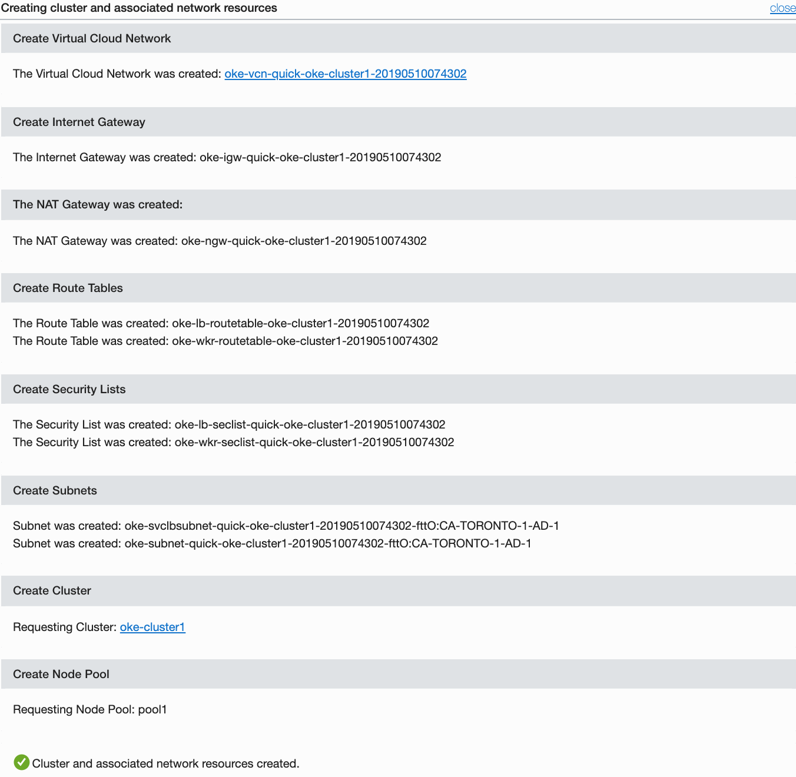
    
  **ACTIVE 상태의 노드**  
    

### **STEP 3**: kubectl과 oci-cli 설치하기
* kubectl 제공되는 Git Repository에서 Clone으로 다운로드 받은 c:\cloud-native-devops-workshop-wercker-oke 폴더안에도 같이 포함되어 있으므로 이 파일을 사용합니다. ==> 다운로드 할 수 있는 경로를 따로 지정해서 설치하도록 수정...

    > 선택사항) 참고로 kubectl 직접 설치를 하고 싶으면 아래 curl 명령어를 통해 설치 가능합니다. 다만, curl 명령어는 Windows Prompt (cmd)에서 실행 합니다. (PowerShell 에서는 옵션이 다름)
    > ```
    > curl -LO https://storage.googleapis.com/kubernetes-release/> release/v1.15.0/bin/windows/amd64/kubectl.exe
    > ```

* 클라이언트에서 OKE 접속을 위해서는 kubeconfig 파일을 생성해야 합니다. kubeconfig 파일을 얻는 과정은 OCI의 OKE Cluster 화면에서 Access **Kubeconfig** 버튼을 클릭하면 확인할 수 있습니다.

    **Access Kubeconfig 버튼** 
    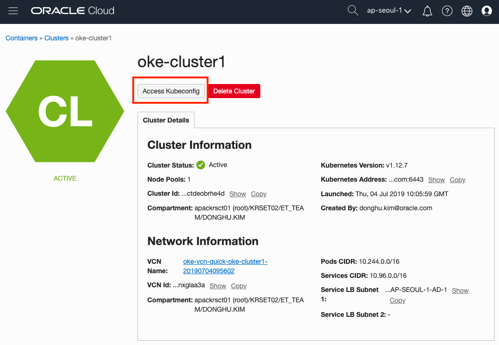

    **Kubeconfig를 얻기 위한 과정**
    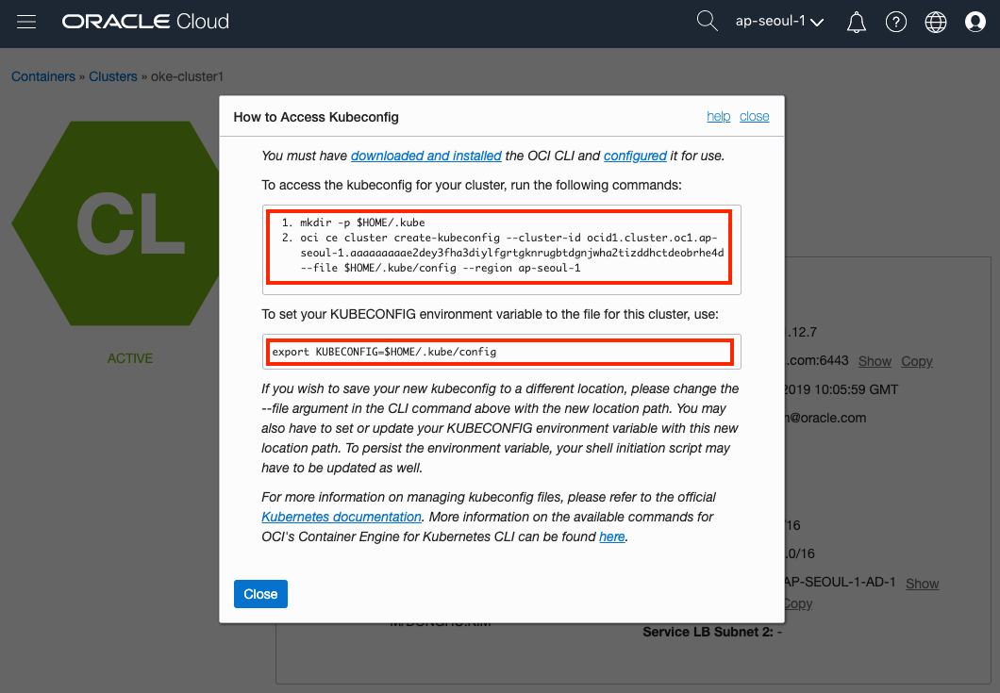

    > **위 내용은 oci-cli 설치 후 실행할 내용이므로 꼭 메모합니다.**

* Kubeconfig를 얻기 위해서는 먼저 **oci-cli**를 설치합니다. Windows의 **Windows PowerShell**을 열고 (Windows 좌측 아래 검색 버튼 클릭 후 PowerShell 입력) 다음과 같이 입력해서 oci-cli를 설치합니다.

    > oci-cli 설치를 위해 Python이 자동으로 설치됩니다.
    ```
    # Set-ExecutionPolicy RemoteSigned

    # powershell -NoProfile -ExecutionPolicy Bypass -Command "iex ((New-Object System.Net.WebClient).DownloadString('https://raw.githubusercontent.com/oracle/oci-cli/master/scripts/install/install.ps1'))"
    ```

* Python 설치가 완료되면 oci-cli 설치 경로를 설정합니다. 경로는 기본 경로(c:\Users\사용자명\)에 설치해도 되지만, Windows의 경우 사용자명에 공백이 있을 경우 설치가 되지 않습니다. 사용자명에 공백이 있을 경우에는 다음과 같이 c:\oracle 경로에 설치합니다.
    ```
    1. c:\oracle\oci-cli
    2. c:\oracle\bin
    3. c:\oracle\bin\oci-cli-scripts
    4. 추가 패키지 설치 여부 (설치 없이 엔터 치고 넘어갑니다)
    ```

* 설치가 완료되면 **PowerShell**을 다시 시작한 후 oci-cli 설치를 확인합니다.
    ```
    # oci -v
    ```

* oci-cli 설치가 완료되면 Oracle Cloud Infrastructure와 연결을 위한 설정을 합니다. 이 때 필요한 정보를 얻는 방법과 설정 방법은 다음과 같습니다.
    1. User OCID  
    User OCID는 OCI Console 우측 상단의 사용자 아이콘을 클릭한 후 아이디를 선택하면 확인할 수 있습니다.
    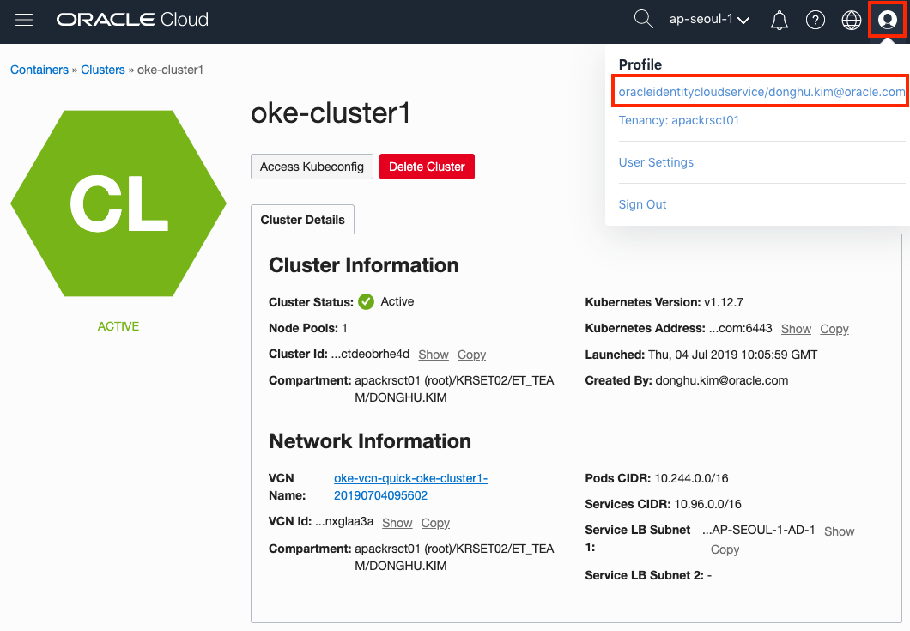
    oci-cli 설치를 위해 필요하기 때문에 User OCID를 복사해서 메모합니다.
    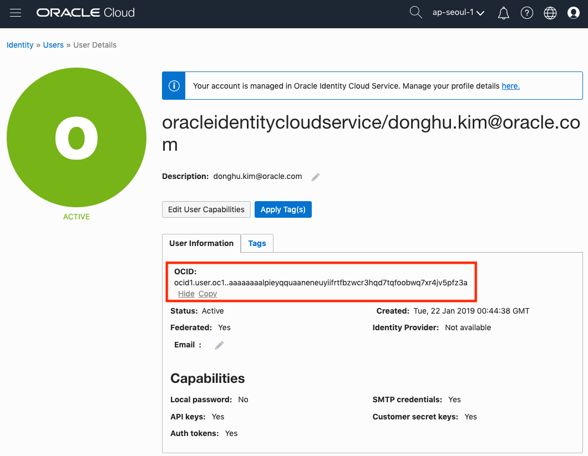
    
    2. Tenancy OCID
    Tenancy OCID는 OCI Console 우측 상단의 사용자 아이콘을 클릭한 후 Tenancy를 선택하면 확인할 수 있습니다.
    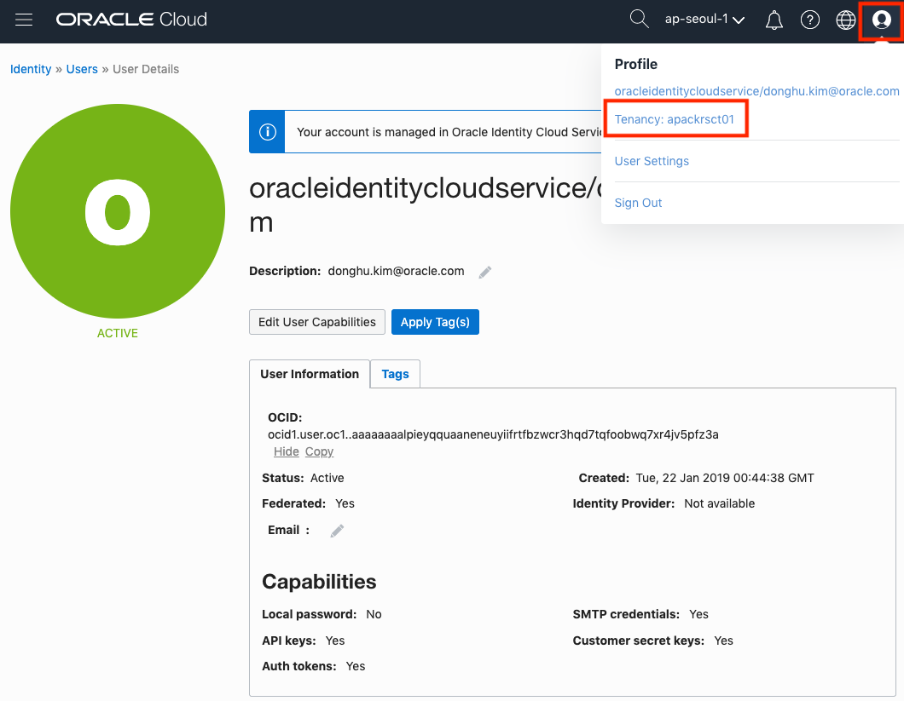
    oci-cli 설치를 위해 필요하기 때문에 Tenancy OCID를 복사해서 메모합니다.
    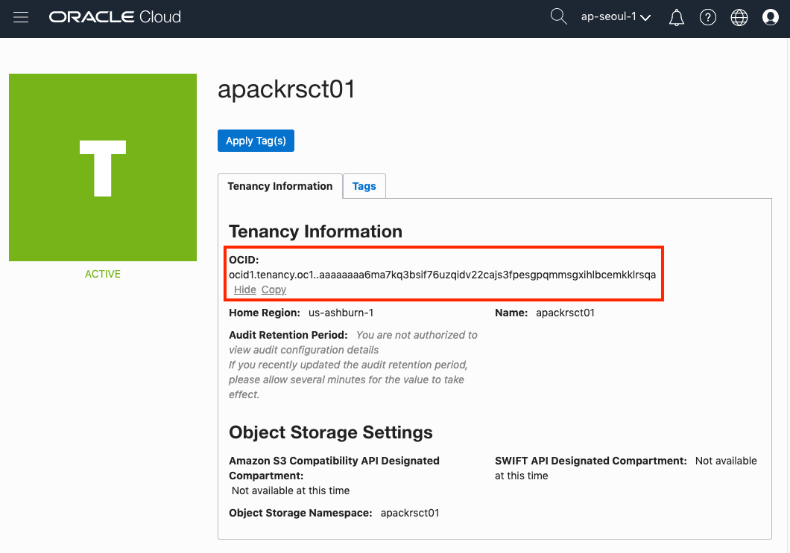

    3. Region
    여기서는 서울 리전으로 지정합니다. (ap-seoul-1)

* oci-cli 설정을 진행합니다. **Windows Powershell**에서 다음과 같이 입력합니다.
    ```
    # oci setup config
    ```

    * Enter a location for your config
        * **Enter (그냥 Enter 치면 c:\Users\사용자이름\.oci 폴더가 기본 폴더로 설정됩니다)**
    * Enter a user OCID
        * **앞에서 획득한 자신의 User OCID**
    * Enter a tenancy OCID
        * **앞에서 획득한 Tenancy OCID**
    * Enter a region
        * **ap-seoul-1**
    * Do you want to generate a new RSA key pair? (SSH Key Pair가 생성됨, 다음 단계에서 OCI에 Public 키를 등록해줌)
        * **y**
    * Enter the location of your private key file:
        * **c:\Users\사용자이름\.oci\oci_api_key.pem**

* c:\Users\사용자이름\.oci 폴더와 config 파일, SSH Key Pair(.pem)가 생성됩니다. SSH Key 중에서 Public Key를 OCI API Key로 등록합니다. 아래와 같이 우측 상단의 사용자 아이콘 클릭 후 사용자 아이디를 클릭 합니다.
    

    좌측 **API Keys** 메뉴 선택 후 **Add Public Key** 버튼 클릭합니다. **PUBLIC KEY** 영역에 위에서 가져온 키 중에서 oci_api_key_public.pem 파일의 내용을 복사해서 붙여넣기 한 후 **Add** 버튼을 클릭합니다.
    

* kubeconfig를 생성합니다. 먼저 **Windows PowerShell**을 통해서 다음과 같이 실행해서 oracle 폴더 하위에 kube 폴더를 생성합니다.
    ```
    # cd $HOME

    # mkdir .kube
    ```
 
 * 앞에서 메모한 kubeconfig 생성 명령어를 실행합니다. 
    ```
    # oci ce cluster create-kubeconfig --cluster-id ocid1.cluster.oc1.ap-seoul-1.aaaaaaaaae2dey3fha3diylfgrtgknrugbtdgnjwha2tizddhctdeobrhe4d --file $HOME/.kube/config --region ap-seoul-1
    ```

* 생성된 kubeconfig 파일을 확인합니다.
    ```
    # cd $HOME\.kube

    # type config
    ```

### **STEP 4**: GitHub Repository 생성
* https://github.com 에 접속 후 우측 상단의 **Sign in** 클릭 하여 로그인합니다. 좌측 **Create a repository**를 클릭 합니다.

    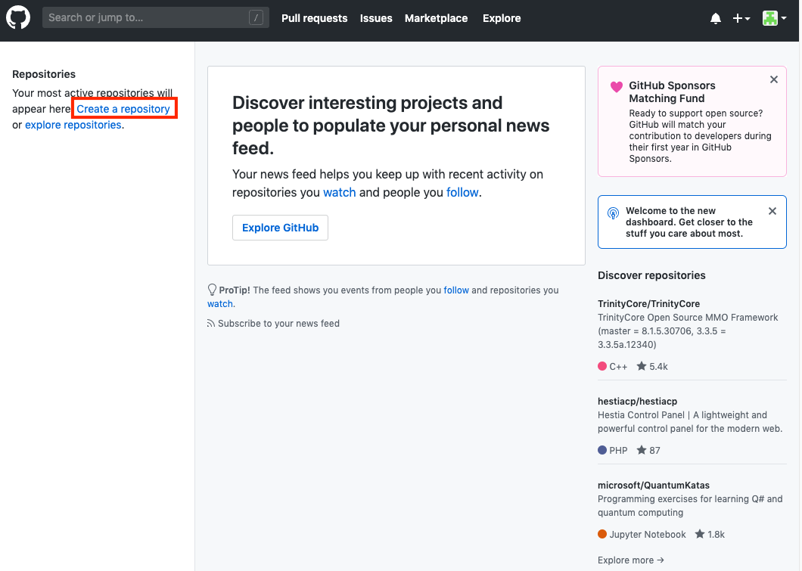

* **Repository name**을 다음과 같이 입력하고 **Create repository**를 클릭 합니다.
    * Repository name
        * cloud-native-devops-workshop-wercker-oke

    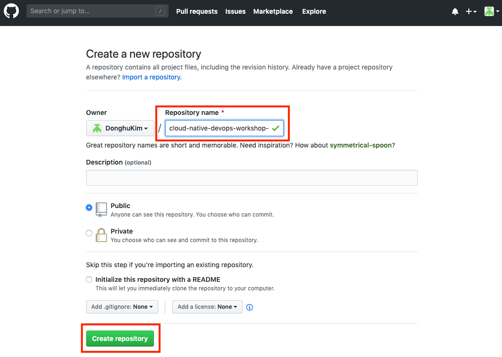

* **Import code**를 클릭합니다. 실습을 위해 제공된 Repository의 소스를 가져오기 위한 과정입니다.

    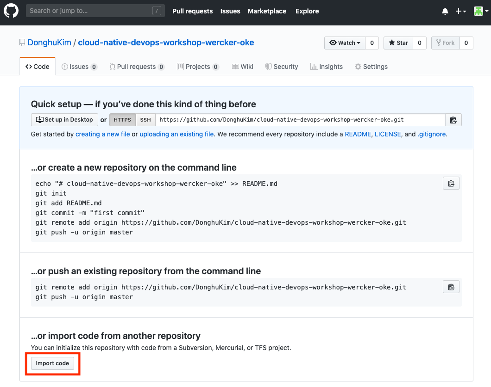

* 가져올 GitHub Repository URL을 다음과 같이 입력합니다.
    * Your old repository’s clone URL
        * https://github.com/MangDan/cloud-native-devops-workshop-wercker-oke

    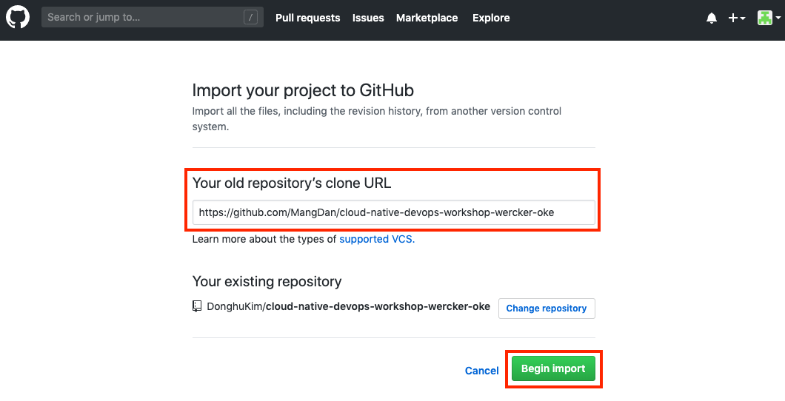

    **Import 완료**가 되면 Repository 링크를 클릭해서 확인합니다.
    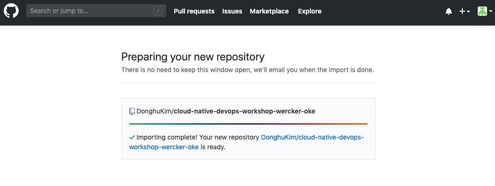

### **STEP 5**: Wercker 환경 구성하기
* https://app.wercker.com 에 접속 후 **LOG IN WITH GITHUB** 클릭 후 생성한 계정을 통해 로그인한 후 **Create your first application**을 클릭합니다. 
    > Wercker Application은 하나의 Git Repository와 연결되는 파이프라인을 구성하기 위한 단위입니다.

    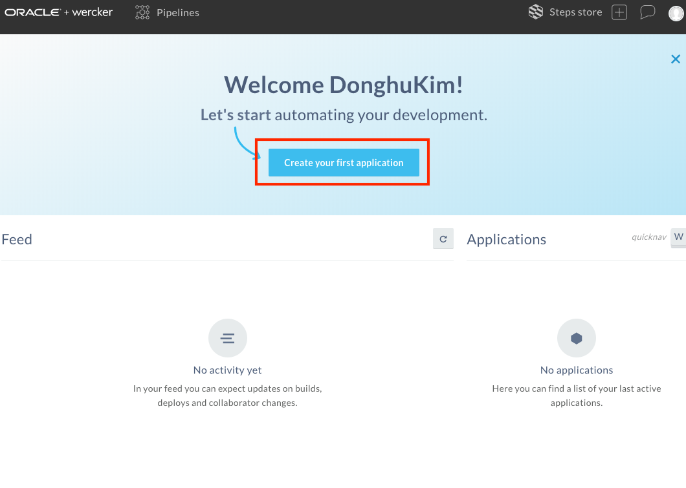

* **Select SCM**에서 GitHub을 선택합니다.

    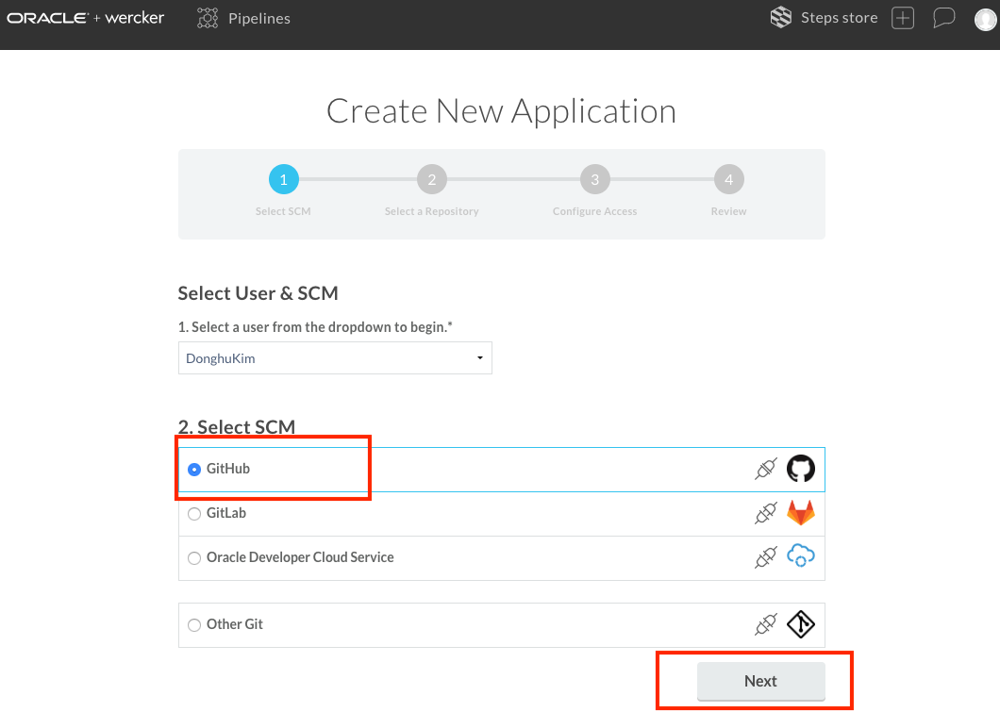

* 앞서 생성한 GitHub Repository가 보입니다. 선택 후 **Next** 버튼을 클릭 합니다.

    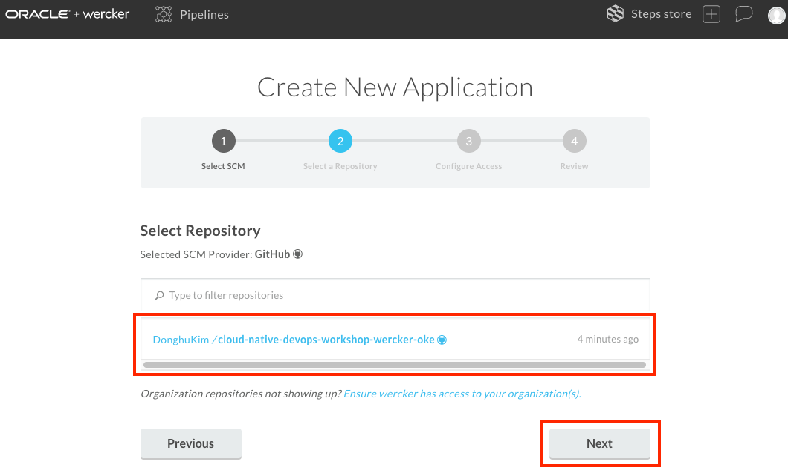

* Git Repository 접속에 필요한 SSH key 설정을 합니다. 실습에서는 SSH key 없이 진행합니다. **Next** 버튼을 클릭 합니다.

    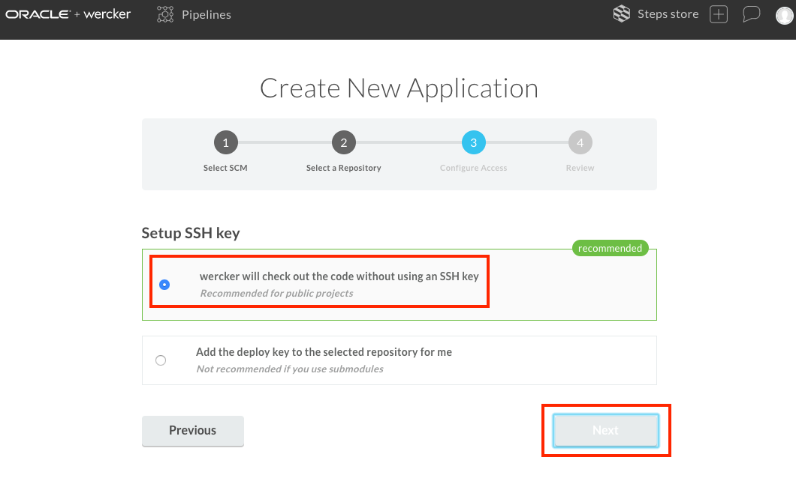

* **Create**버튼을 클릭해서 Wercker Application을 생성합니다.

    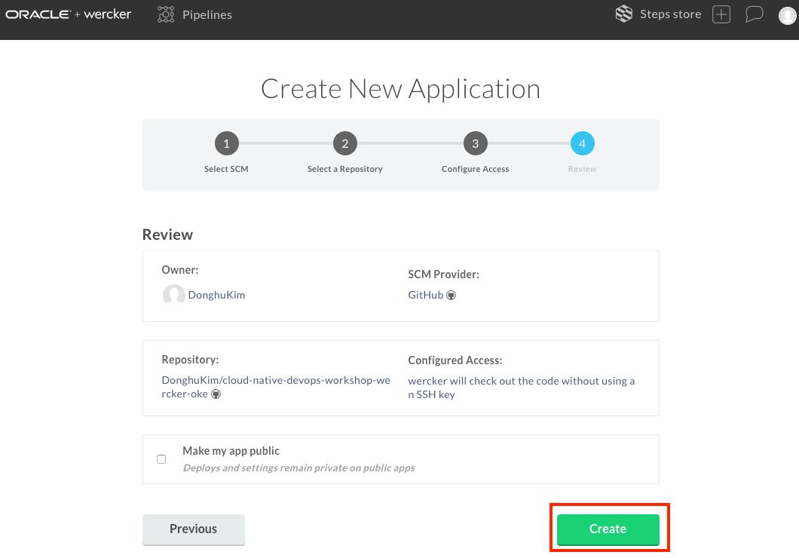

    **Wercker Application 생성**
    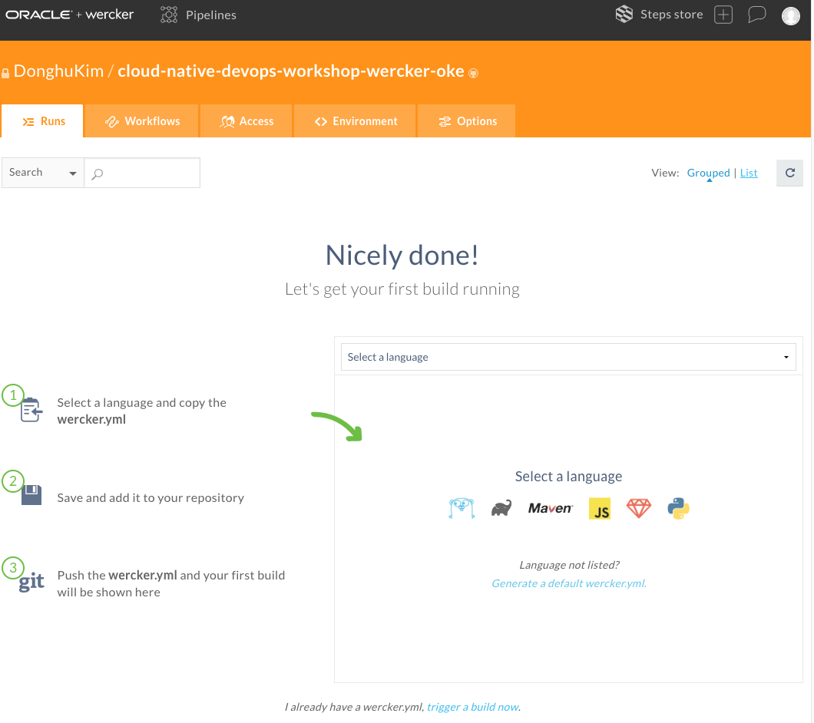


* Wercker Application에서 **Oracle Container Registry** 에 컨테이너 이미지를 푸시하기 위한 설정을 합니다. 상단 탭 메뉴중에서 **Environment**를 선택합니다.

    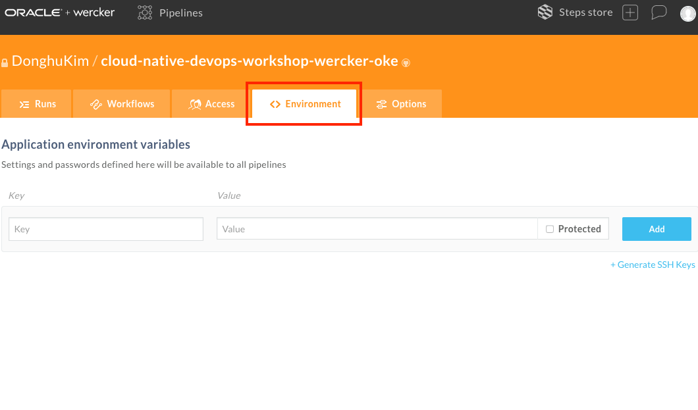

    여기서 필요한 Key와 Value는 다음과 같습니다. 
    1. OCI_AUTH_TOKEN
    2. DOCKER_REGISTRY
    3. DOCKER_USERNAME
    4. DOCKER_REPO
    5. KUBERNETES_MASTER
    6. KUBERNETES_AUTH_TOKEN
    
    여기서 KUBERNETES_MASTER와 KUBERNETES_AUTH_TOKEN에 대한 정보는 $HOME/.kube/config 파일의 내용에서 가져올 것입니다.

    * OCI_AUTH_TOKEN
        * OCI Console 우측 상단의 사용자 아이디를 클릭 후 좌측 **Auth Tokens**를 선택한 후 **Generate Token**을 클릭합니다.
        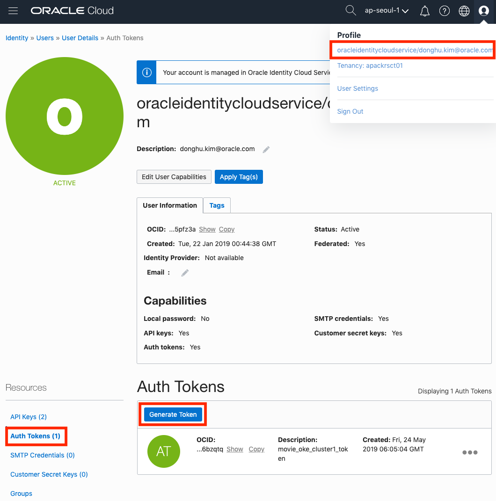
        
        DESCRIPTION에 임의로 **Wercker Token**이라고 입력한 후 **Generate Token** 버튼을 클릭합니다.

        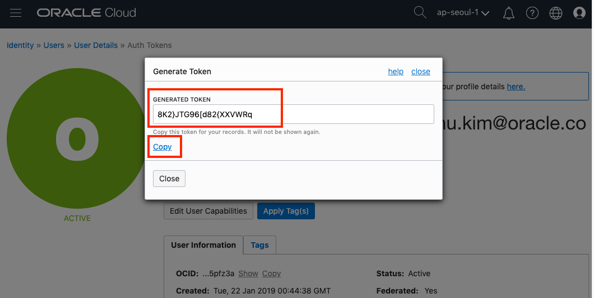
        
        생성된 토큰을 복사한 후 Wercker에 다음과 같이 입력하고 Add 버튼을 클릭합니다.

        **Key:** OCI_AUTH_TOKEN  
        **Value:** 토큰 값 (예. 8K2}JTG96[d82{XXVWRq)

        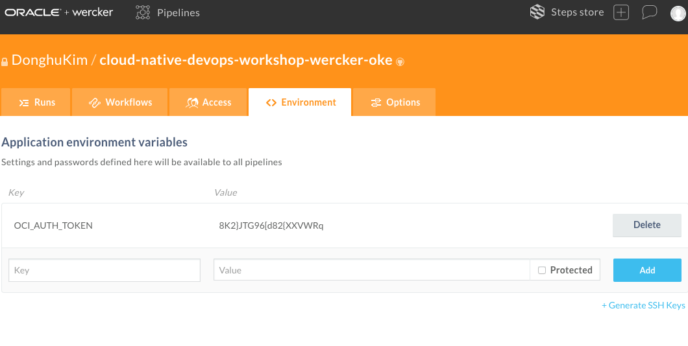
        
    * DOCKER_REGISTRY
        * Container Registry는 각 리전별로 존재합니다. Registry는 리전키 + ocir.io로 구성되는데, 리전키의 경우는 현재 icn(서울), nrt(도쿄), yyz(토론토), fra(프랑크푸르트), lhr(런던), iad(애쉬번), phx(피닉스)입니다. 여기서는 서울 리전에 있는 Registry를 사용하도록 하겠습니다.

        **Key:** DOCKER_REGISTRY  
        **Value:** icn.ocir.io

    * DOCKER_USERNAME
        * Docker Username은 OCI 사용자 아이디입니다. OCI Console 우측 상단의 사람 아이콘을 클릭해서 확인할 수 있습니다. 여기에 Tenancy명이 필요합니다. 보통 이름은 다음과 같이 구성됩니다.

        **Key:** DOCKER_USERNAME  
        **Value:** {Tenancy명}/oracleidentitycloudservice/이메일 계정 (예. busanbank1/oracleidentitycloudservice/donghu.kim@oracle.com)

    * DOCKER_REPO
        * Docker Repository이름으로 Tenancy명 + {레파지토리명}입니다. 레파지토리 이름은 임의 지정합니다.

        **Key:** DOCKER_REPO  
        **Value:** {Tenancy명}/{레파지토리 명} (예. busanbank1/oracle-devops-workshop)

    * KUBERNETES_MASTER와 KUBERNETES_AUTH_TOKEN는 .kube/config 파일에서 얻을 수 있습니다. 해당 파일을 편집기로 열어서 MASTER와 TOKEN을 복사해서 입력합니다.

        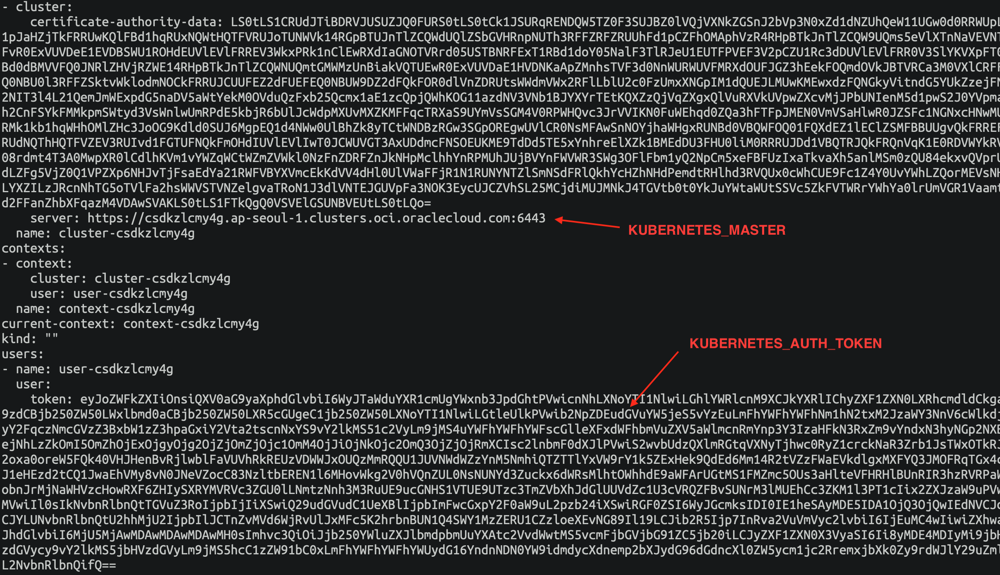
  
        **Key:** KUBERNETES_MASTER 
        **Value:**: KUBERNETES MASTER URL (예. https://c3donjwgqzd.ap-seoul-1.clusters.oci.oraclecloud.com:6443)

        **Key:** KUBERNETES_AUTH_TOKEN 
        **Value:**: KUBERNETES AUTH TOKEN (예. LS0tLS1CRUdJTiBDRVJUSU................)

* Wercker Application 환경 설정을 완료한 모습입니다.
    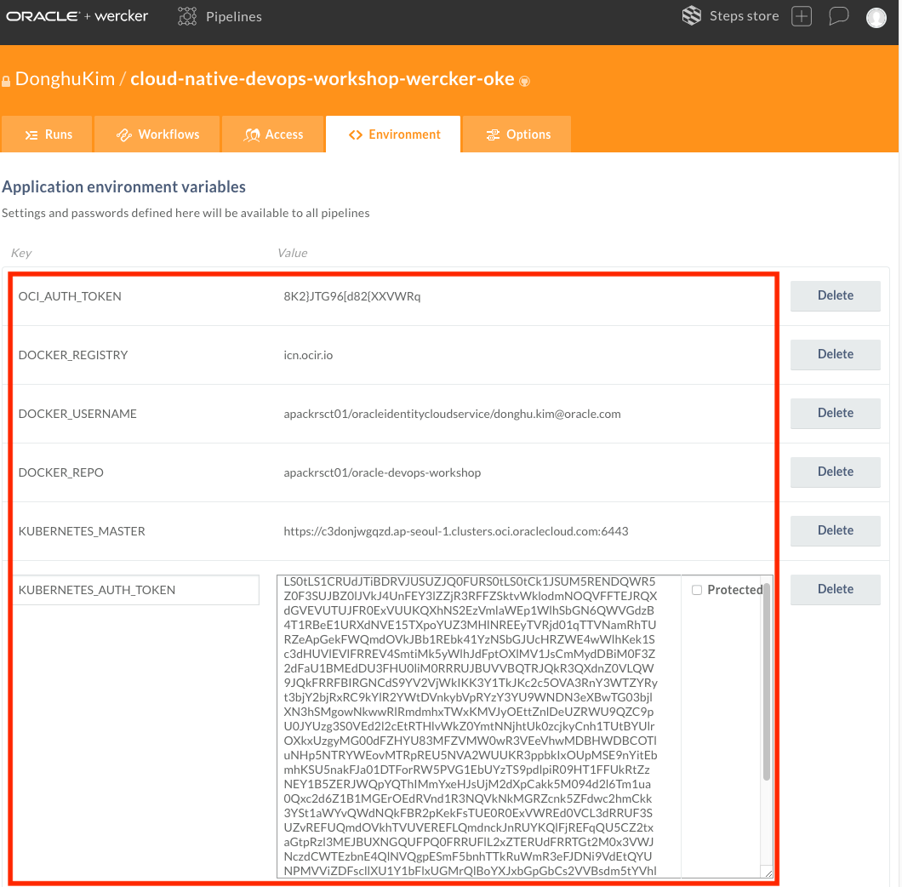

### **STEP 6**: Wercker와 Kubernetes 설정 파일 구성하기 (옵션: Blue/Green Deployment)
* 로컬에 다운로드 받은 Git Repository 폴더 (c:\cloud-native-devops-workshop-wercker-oke)에 작성된 설정 파일을 사용합니다. 설정 파일은 다음과 같습니다.
    * wercker.yml
        * Wercker CI/CD의 Pipeline을 구성을 위한 설정 파일
    * kube-helidon-movie-api-mp-config.yml.template
        * helidon-movie-api-mp 서비스를 Kubernetes 환경에 배포하기 위한 설정 파일
    * kube-springboot-movie-people-api-config.yml.template
        * springboot-movie-people-api 서비스를 Kubernetes 환경에 배포하기 위한 설정 파일


### **STEP 6**: Wercker CI/CD Pipeline 구성하기

### **STEP 7**: 애플리케이션을 GitHub에 커밋하기

### **STEP 8**: CI/CD 파이프라인 진행 모니터링 하기

### **STEP 9**: Kubernetes 배포된 Pod와 Service 확인

### **STEP 10**: 최종 배포된 애플리케이션 확인


### Git 설치
* Git 설치는 아래 블로그를 참고하여 설치합니다.  
    * https://boogong.tistory.com/58

### Git Repository Clone
* Git 설치가 완료되면 실습을 위해 제공된 GitHub Repository를 로컬에 다운로드 받는 Clone 작업을 합니다. 먼저, Windows 좌측 하단의 검색 버튼을 클릭하고 **PowerShell**을 입력한 후 **Windows PowerShell**을 실행합니다.

    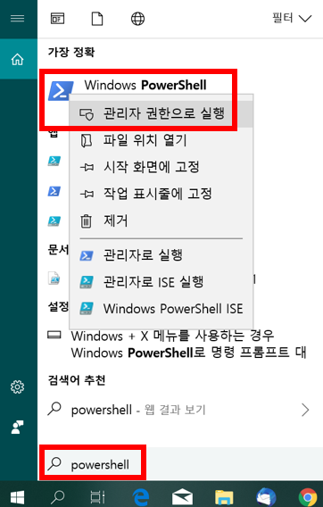

    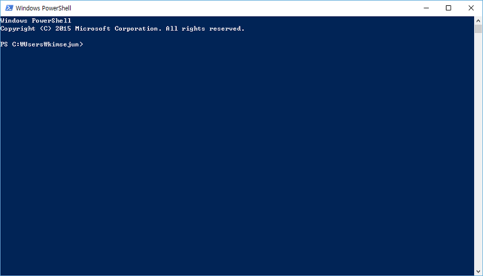

* **Windows PowerShell**에서 다음과 같이 입력해서 C 드라이브에 실습을 위한 Git Repository를 가져옵니다.
    > #은 구분 표시로 입력하지 않습니다.
    ```
    # cd c:\
    # git clone https://github.com/MangDan/cloud-native-devops-workshop-wercker-oke.git
    ```