# Cloud Native DevOps Hands-On Workshop - Wercker and OKE (Oracle Kubernetes Engine)


## Introduction
본 핸즈온 워크샵은 마이크로 서비스 애플리케이션에 대한 빌드/테스트/배포 자동화를 위한 CI/CD 파이프라인을 구성하고, 이를 관리형 쿠버네티스 서비스에 배포하는 전반적인 과정을 다루고 있습니다. 본 과정을 통해서 오라클의 컨테이너 기반 CI/CD 서비스인 Wercker(워커)와 오라클의 컨테이너 서비스인 Oracle Kubernetes Engine (OKE) 및 Oracle Container Registry Service에 대한 경험을 해볼 수 있습니다. 

## Objectives
* Oracle Kubernetes Cluster 생성
* Wercker 환경 구성, 파이프라인 이해 및 빌드
* Kubernetes Container 배포

## Required Artifacts
* GitHub 계정
* OCI (Oracle Cloud Infrastructure) 계정
* Git 설치

***

## **STEP 1**:  Setup

### GitHub 계정 생성
* https://github.com 에 접속해서 우측 상단 **Sign up**을 클릭합니다.
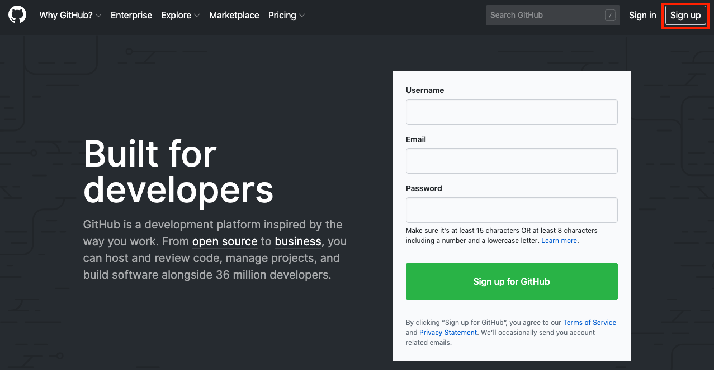

* 다음 내용을 입력하고 **Create an account** 클릭해서 계정 생성합니다. 검증 메일이 발송되기 때문에 정확한 이메일을 입력해야 합니다. GitHub으로 부터 수신받은 이메일에서 **Verify email address**를 클릭해서 계정 생성을 완료합니다.

    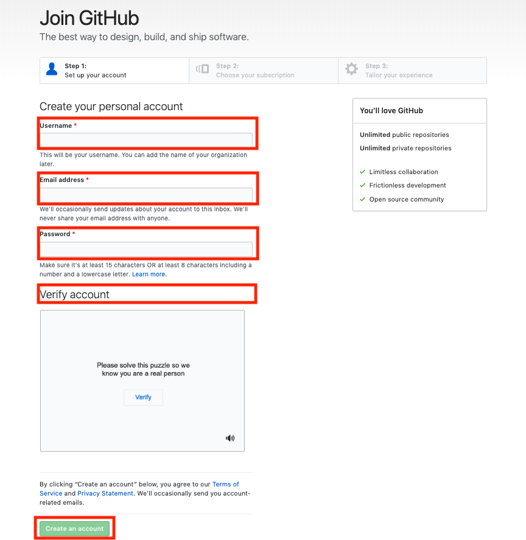

    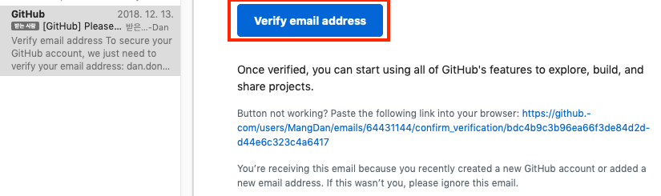

* 생성한 계정으로 Sign in 합니다.

    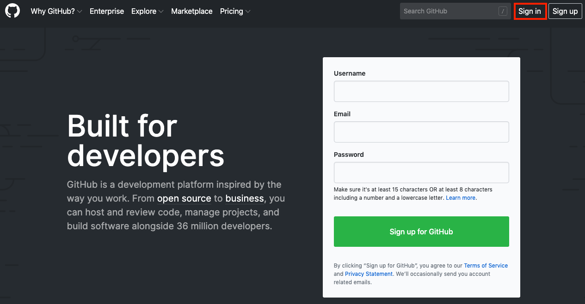

    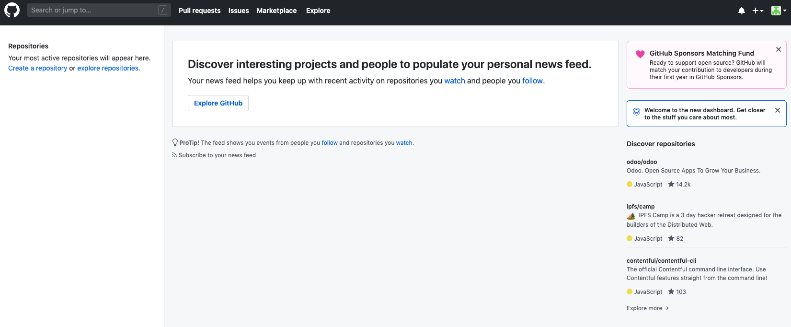
    
### Wercker 계정 생성
* https://app.wercker.com 에 접속합니다.
    > GitHub에 이미 로그인 되어 있다면 아래 로그인 화면이 아닌 **Authorize wercker** 화면을 볼 수 있습니다.

    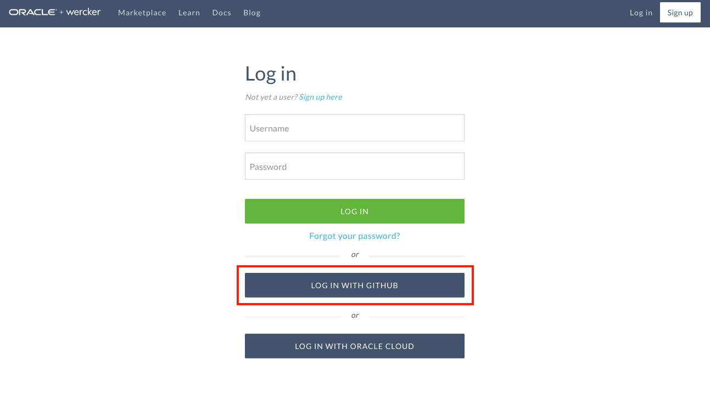

* GitHub 아이디와 패스워드를 입력하고 **Sign in** 버튼을 클릭합니다.
    > GitHub에 이미 로그인 되어 있다면 아래 로그인 화면이 아닌 **Authorize wercker** 화면을 볼 수 있습니다.

    
    
* **Authorize wercker** 버튼을 클릭합니다.
    > GitHub에 이미 로그인 되어 있다면 바로 **Authorize wercker** 화면을 볼 수 있습니다.

    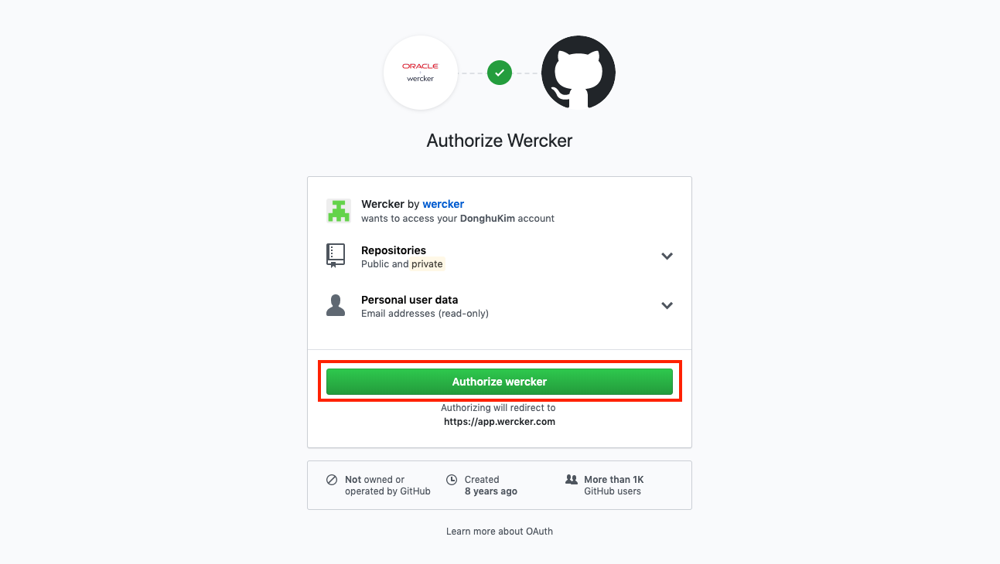

* Wercker에서 사용할 이름과 이메일을 입력합니다. GitHub과 동일하게 입력해 줍니다.

    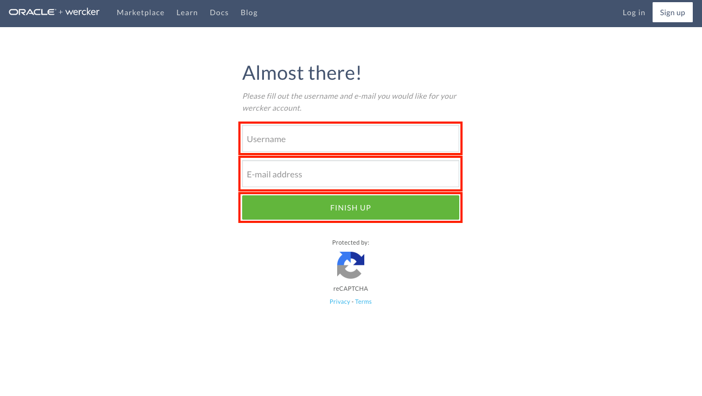

    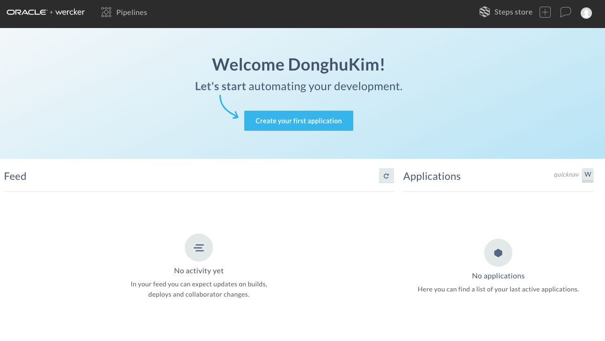

### Git 설치
* Git 설치는 아래 블로그를 참고하여 설치합니다.  
    * https://boogong.tistory.com/58

### Git Repository Clone
* Git 설치가 완료되면 실습을 위해 제공된 GitHub Repository를 로컬에 다운로드 받는 Clone 작업을 합니다. 먼저, Windows Command Prompt**를 오픈 합니다.

    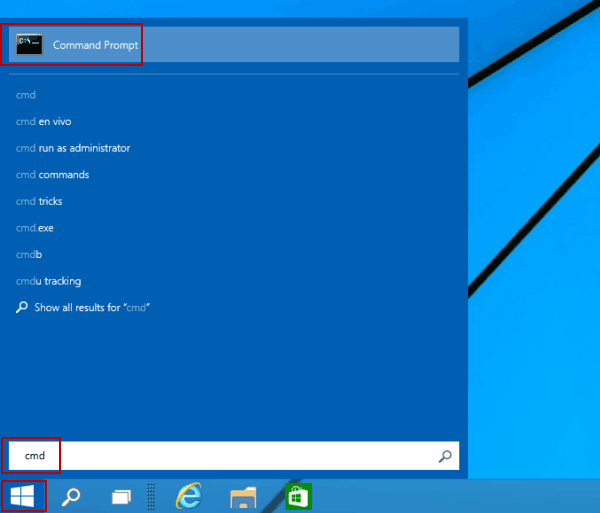
    [Image Source: https://www.isunshare.com/windows-10/4-ways-to-open-command-prompt-in-windows-10.html]

* Command Prompt에서 다음과 같이 입력해서 C 드라이브에 실습을 위한 Git Repository를 가져옵니다.
```
# cd c:\
# git clone https://github.com/MangDan/cloud-native-devops-workshop-wercker-oke.git
```

### **STEP 2**: OCI에서 Kubernetes Cluster 생성하기
* 먼저 OCI에 로그인합니다. 아래 URL을 통해서 Seoul Region으로 접속합니다.
    > tenancy 명은 처음 Oracle Cloud Subscription 시에 명명합니다.

    * https://console.ap-seoul-1.oraclecloud.com/?tenant={tenancy명}

    > 두 가지 로그인 타입이 있습니다. OCI 전용 계정이 있으며, IDCS라는 계정 관리를 위한 클라우드 서비스와 연동 (Federation)해서 사용하는 계정이 있습니다. 생성한 계정 타입을 확인 후 관련 계정으로 로그인 합니다.

    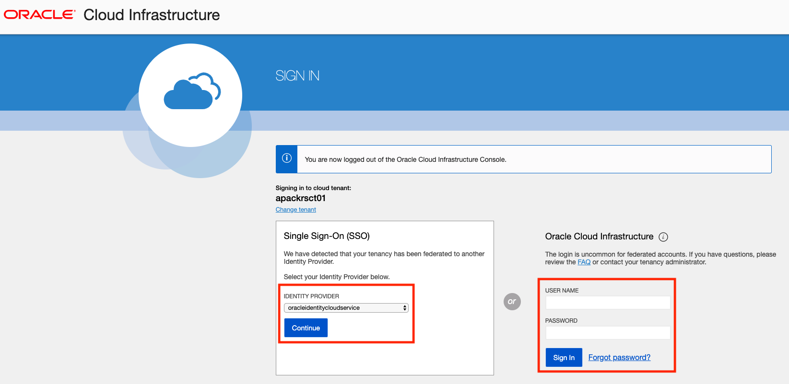

    좌측 상단의 햄버거 모양의 아이콘을 클릭합니다.
    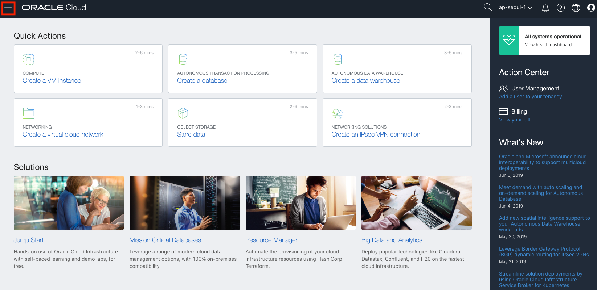

* 좌측 메뉴 중 **Developer Services** > **Container Clusters (OKE)** 선택합니다.

    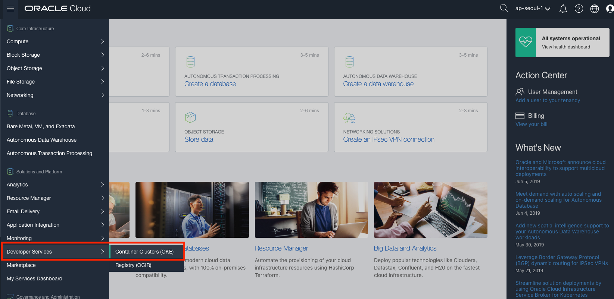

* OKE Cluster를 생성 할 Compartment를 선택합니다.
    > Compartment는 OCI에서 관리하는 리소스들을 그룹으로 묶어서 관리하기 위해 제공되는 기능입니다. 일반적으로 팀 단위로 리소스(Compute, Network, Storage등)를 관리하기 위한 목적으로 사용됩니다. Compartment는 구성하기 나름이기 때문에 아래 스크린샷과 다를 수 있습니다.

    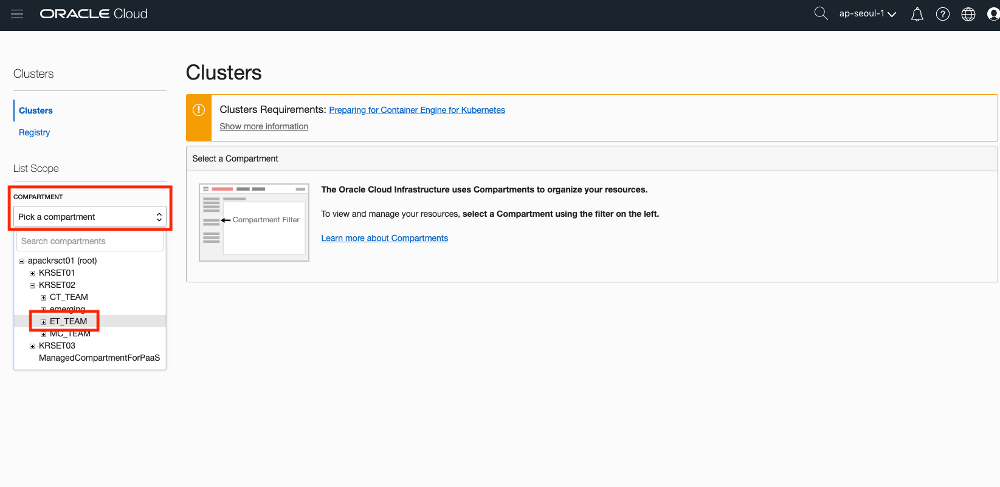

* OKE Cluster 생성을 위해 **Create Cluster**버튼을 클릭 합니다.

    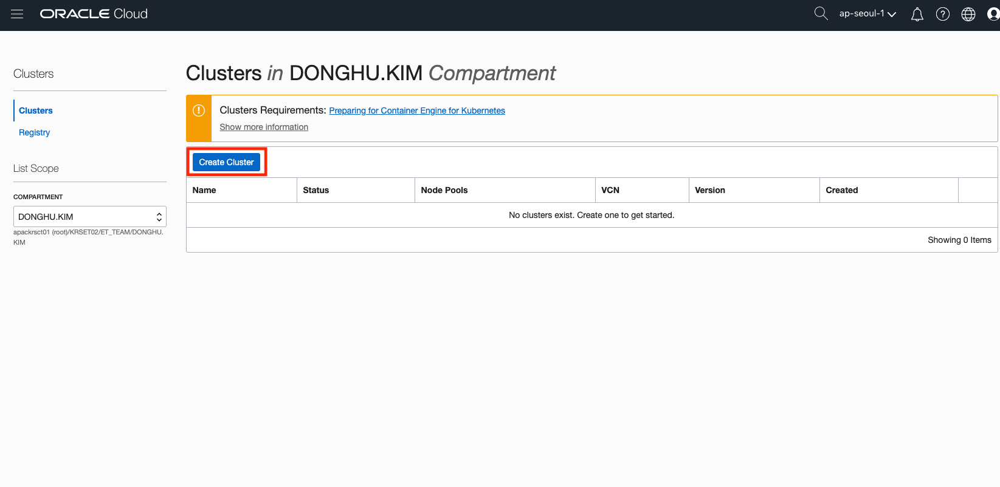

* 다음과 같이 입력합니다. 
    > Compute Shape의 의미는 다음과 같습니다. VM.Standard2.1은 Virtual Machine 2세대

    * NAME: oke-cluster1
    * KUBERNETES VERSION: v1.12.7
    * QUICK CREATE: CHECK
    * SHAPE: VM.Standard2.1
    * QUANTITY PER SUBNET: 1

    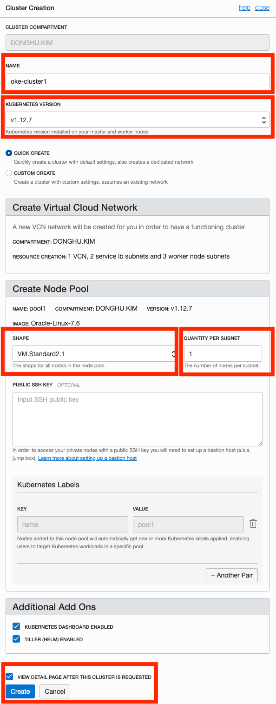


### **STEP 3**: oci-cli와 kubectl 설치하기

### **STEP 4**: Wercker 환경 구성하기

### **STEP 5**: Wercker와 Kubernetes 설정 파일 구성하기 (옵션: Blue/Green Deployment)

### **STEP 6**: Wercker CI/CD Pipeline 구성하기

### **STEP 7**: 애플리케이션을 GitHub에 커밋하기

### **STEP 8**: CI/CD 파이프라인 진행 모니터링 하기

### **STEP 9**: Kubernetes 배포된 Pod와 Service 확인

### **STEP 10**: 최종 배포된 애플리케이션 확인